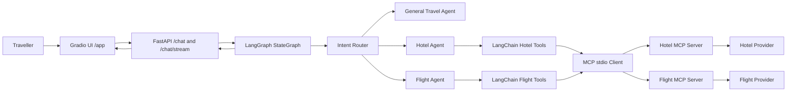

# TripWeaver — MCP-Based Multi-Agent Travel Planner

[](https://github.com/Bhanura/travel_planner/actions/workflows/ci.yml)

TripWeaver is a deployed conversational travel assistant built with FastAPI, Gradio, LangGraph, LangChain, and the Model Context Protocol (MCP). It routes a traveller's natural-language request to a General Travel, Hotel, or Flight agent, retrieves live provider data through MCP tools, streams visible progress and response text, and protects hotel and flight bookings with explicit human confirmation.

## Live Project

- **Application:** <https://tripweaver-backend-staging-bhanu.onrender.com/app/>
- **Health:** <https://tripweaver-backend-staging-bhanu.onrender.com/health>
- **API documentation:** <https://tripweaver-backend-staging-bhanu.onrender.com/docs>
- **Source repository:** <https://github.com/Bhanura/travel_planner>
- **CI runs:** <https://github.com/Bhanura/travel_planner/actions>

> The Render free instance may need extra time to respond after inactivity.

## Core Features

- Intent-routed LangGraph workflow for hotel, flight, and general travel requests.
- Six capabilities exposed through MCP: list, search, and book hotels; list, search, and book flights.
- Follow-up questions for missing search and booking details instead of invented values.
- Genuine incremental NDJSON streaming with traveller-safe Agent Journey activities.
- Ocean Blue and Sunset Orange responsive Gradio interface mounted at `/app/`.
- Structured hotel and flight cards with natural result selection.
- Session-aware, multi-turn hotel and flight booking flows.
- Explicit confirmation, cancellation, and detail changes before booking.
- Friendly empty-result, provider-failure, graph-failure, and streaming errors.
- Automated tests with provider, LLM, and booking boundaries mocked by default.

## Architecture



| Layer | Responsibility |
| --- | --- |
| Gradio frontend | Captures messages and renders streaming text, Agent Journey activities, and structured results. |
| FastAPI backend | Exposes health, JSON chat, NDJSON streaming, and the mounted `/app/` UI. |
| LangGraph workflow | Routes intent and passes shared `GraphState` between specialised nodes. |
| LangChain tools | Give agents stable hotel and flight tool interfaces. |
| MCP client | Starts the correct MCP server as a stdio subprocess and calls its tools. |
| MCP servers | Own provider-specific HTTP logic and return structured data. |

The deployed Render service hosts FastAPI and the mounted Gradio application in one process. The Hotel and Flight MCP servers remain separate stdio subprocesses launched at runtime by the MCP client. Agents never call provider APIs directly.

## Request Flow

1. The traveller submits a natural-language message.
2. FastAPI restores lightweight session context and builds `GraphState`.
3. The LangGraph router extracts intent and selects the General, Hotel, or Flight node.
4. The selected agent asks for missing inputs or invokes a LangChain tool.
5. The LangChain tool calls the relevant MCP tool through the stdio MCP client.
6. LangGraph updates become safe `activity` events, while answer text is emitted as `delta` events.
7. A canonical `message` event carries the final text and optional structured results.
8. A `done` event terminates the stream, including after safe error recovery.

## MCP Integration

TripWeaver uses two FastMCP servers:

| Server | MCP tool | Purpose |
| --- | --- | --- |
| Hotel | `list_hotels` | Return all available hotels. |
| Hotel | `search_hotels` | Search by city and optional dates. |
| Hotel | `book_hotel` | Submit a confirmed hotel booking. |
| Flight | `list_flights` | Return all available flights. |
| Flight | `search_flights` | Search by origin, destination, and optional date. |
| Flight | `book_flight` | Submit a confirmed flight booking. |

`agents/tools.py` provides the stable LangChain boundary. `agents/mcp_client.py` launches either `mcp_servers.hotel_server` or `mcp_servers.flight_server`, initializes an MCP session, invokes a named tool, and converts its response to plain Python data. Provider URLs and HTTP behavior remain inside the MCP layer, so the graph is decoupled from provider code.

## Booking Safety

Hotel and flight bookings share the same safety pattern:

1. Search or list available results.
2. Select an option naturally by displayed number or stable identifier.
3. Collect only the missing booking details across turns.
4. Store a pending booking in the current in-memory session.
5. Show a full summary before any provider booking call.
6. Accept `yes` to confirm, `cancel` to stop, or a natural-language detail change.
7. Call the MCP booking tool only after explicit confirmation.
8. Return the provider status and booking reference when available.

Pending state is cleared after success or cancellation. A failed provider call returns a safe message and preserves enough pending context to retry without exposing private exception details.

## Project Structure

```text
.
|-- .github/workflows/ci.yml       # Tests, compilation, dependency, and Gitleaks checks
|-- agents/
|   |-- entity.py                  # Shared LangGraph state schema
|   |-- graph.py                   # Intent-routed StateGraph
|   |-- llm.py                     # Chat model configuration
|   |-- mcp_client.py              # stdio MCP client adapter
|   |-- nodes.py                   # Router and specialised agent nodes
|   |-- prompts.py                 # Extraction and general-travel prompts
|   `-- tools.py                   # LangChain-to-MCP boundary
|-- frontend/
|   |-- __main__.py                # Optional standalone Gradio launch
|   |-- api_client.py              # JSON and NDJSON API client
|   |-- handlers.py                # Incremental UI response handler
|   |-- layout.py                  # Gradio component layout
|   |-- presenters.py              # Agent Journey and result presentation
|   |-- static/                    # Travel image and CSS
|   `-- theme.py                   # Gradio theme configuration
|-- mcp_servers/
|   |-- hotel_server.py            # Hotel FastMCP server
|   |-- flight_server.py           # Flight FastMCP server
|   `-- provider_utils.py          # Provider HTTP helpers
|-- tests/                         # Mocked contract and regression tests
|-- entity.py                      # FastAPI request/response models
|-- main.py                        # FastAPI app and mounted Gradio UI
|-- streaming_events.py            # NDJSON deltas and activities
|-- render.yaml                    # Render Blueprint
|-- requirements.in                # Direct runtime dependencies
|-- requirements.txt               # Locked runtime dependencies
|-- requirements-dev.txt           # Locked test dependencies
`-- .env.example                   # Safe configuration template
```

## Local Setup

### Prerequisites

- Python 3.11
- An OpenAI API key
- Reachable hotel and flight provider base URLs

### 1. Create and activate a virtual environment

```bash
python -m venv env
```

PowerShell:

```powershell
.\env\Scripts\Activate.ps1
```

macOS/Linux:

```bash
source env/bin/activate
```

### 2. Install locked dependencies

```bash
python -m pip install -r requirements.txt
```

For tests, also install:

```bash
python -m pip install -r requirements-dev.txt
```

Direct dependencies are maintained in `requirements.in` and `requirements-dev.in`. The corresponding `.txt` files pin the complete tested environment for reproducible CI and deployment.

### 3. Configure the environment

PowerShell:

```powershell
Copy-Item .env.example .env
```

macOS/Linux:

```bash
cp .env.example .env
```

| Variable | Required | Purpose |
| --- | --- | --- |
| `OPENAI_API_KEY` | Yes | Authenticates the chat model. |
| `OPENAI_MODEL` | No | Chat model name; the example uses `gpt-4o-mini`. |
| `HOTEL_PROVIDER_BASE_URL` | Yes | Base URL used only by the Hotel MCP server. |
| `FLIGHT_PROVIDER_BASE_URL` | Yes | Base URL used only by the Flight MCP server. |
| `LOG_LEVEL` | No | Python logging level; use `INFO` in deployment. |
| `TRAVEL_PLANNER_API_URL` | No | Frontend API override; defaults to the application port. |
| `ALLOWED_ORIGINS` | Yes | Comma-separated browser origins; wildcard `*` is rejected. |

The real `.env` is ignored by Git. Never commit credentials.

### 4. Run the combined application

```bash
python -m uvicorn main:app --reload --host 127.0.0.1 --port 8000
```

Open:

- Application: <http://127.0.0.1:8000/app/>
- Health: <http://127.0.0.1:8000/health>
- OpenAPI docs: <http://127.0.0.1:8000/docs>

For standalone frontend development, keep the backend running and use:

```bash
python -m frontend
```

The standalone frontend defaults to <http://127.0.0.1:7860/> and uses `TRAVEL_PLANNER_API_URL=http://127.0.0.1:8000`.

## API

| Endpoint | Method | Description |
| --- | --- | --- |
| `/` | GET | Service metadata and links. |
| `/health` | GET | Safe configuration readiness without provider calls. |
| `/docs` | GET | Interactive OpenAPI documentation. |
| `/hotels` | GET | Development endpoint that lists hotels through MCP. |
| `/flights` | GET | Development endpoint that lists flights through MCP. |
| `/chat` | POST | Non-stream JSON chat endpoint. |
| `/chat/stream` | POST | Incremental `application/x-ndjson` chat endpoint. |
| `/app/` | GET | Mounted traveller-facing Gradio application. |

### Chat request

Both chat endpoints accept:

```json
{
  "message": "Find flights from Bangkok to Singapore",
  "session_id": "demo-session-1"
}
```

`session_id` is optional, but a stable value preserves search results, conversation context, and pending booking state across requests.

### Non-stream response

```json
{
  "response": "I found 18 flight options: ...",
  "hotels": null,
  "flights": []
}
```

### NDJSON stream contract

Each line returned by `/chat/stream` is one JSON object:

| Type | Fields | Purpose |
| --- | --- | --- |
| `activity` | `stage`, `message` | Routing, searching, clarifying, booking, responding, or error progress. |
| `delta` | `content` | Incremental text appended to the active assistant bubble. |
| `message` | `content`, `hotels`, `flights` | Canonical final answer and structured results. |
| `error` | `message` | Safe unexpected-stream failure message. |
| `done` | — | Terminates every stream. |

```json
{"type":"activity","stage":"routing","message":"Understanding your request..."}
{"type":"activity","stage":"searching","message":"Flight options found."}
{"type":"delta","content":"I found "}
{"type":"delta","content":"18 flight options."}
{"type":"message","content":"I found 18 flight options.","hotels":null,"flights":[]}
{"type":"done"}
```

If live model tokens are unavailable for a response, the backend emits safe text chunks before the canonical `message`. On unexpected failure, it emits `error` followed by `done` without exposing stack traces.

## User Guide

### General travel

- `Give me three packing tips for Bangkok.`
- `What should I know about visiting during the rainy season?`

### Hotels

- `Find hotels in Bangkok.`
- `Show all available hotels.`
- `Book option 2.`
- `Change my email to tripweaver.changed@example.com.`
- `Cancel hotel.`

### Flights

- `Find flights from Bangkok to Singapore.`
- `Book option 3.`
- `My passenger name is TripWeaver Test and my email is tripweaver.test@example.com.`
- `Change passenger name to TripWeaver Changed.`
- `Yes.`

Use test passenger details and controlled provider data when demonstrating booking. Never use sensitive personal information in screenshots or submissions.

## Testing and CI

```bash
python -m pytest -q
python -m compileall -q main.py entity.py frontend agents mcp_servers tests
python -m pip check
git diff --check
```

Final Priority 4 verification completed with **93 passing tests**. Coverage includes routing, clarification, no-result behavior, provider-failure isolation, session persistence, confirmation safety, booking changes and cancellation, rich success responses, mounted UI availability, and genuine multi-chunk streaming.

GitHub Actions runs the locked Python 3.11 suite, compilation, dependency consistency, and Gitleaks history scanning. Provider, LLM, and booking boundaries are mocked in default CI, so automated checks do not create live bookings or require live services.

## Deployment

`render.yaml` defines one Render web service:

- Runtime: Python 3.11
- Build: install locked `requirements.txt`
- Start: `python -m uvicorn main:app --host 0.0.0.0 --port $PORT`
- Health check: `/health`
- Deploy branch: `main`
- Auto-deploy: after checks pass

Configure `OPENAI_API_KEY`, `HOTEL_PROVIDER_BASE_URL`, `FLIGHT_PROVIDER_BASE_URL`, and `ALLOWED_ORIGINS` in Render. Do not commit their real values. The mounted Gradio frontend communicates with FastAPI inside the same process, so the hosted deployment does not need a separate frontend service or public `TRAVEL_PLANNER_API_URL` override.

After deployment, verify `/health`, `/docs`, `/app/`, hotel and flight search, incremental streaming, result cards, safe errors, and only controlled booking confirmation flows.

## Resilience and Security

- Hotel and flight provider failures are isolated, so other agents remain usable.
- Unexpected graph failures return a safe fallback.
- Streaming failures emit a safe `error` event and finish with `done`.
- Technical details remain in structured logs, not traveller responses.
- Provider settings are supplied through environment variables.
- CORS rejects wildcard configuration and accepts explicit origins only.
- `.env` is ignored, and Gitleaks scans Git history in CI.

## Current Limitations

- Session and pending-booking state is in process memory and resets when the Render instance restarts or moves to another process.
- The Render free service may cold-start after inactivity.
- Availability depends on the external providers; valid searches may honestly return no results.
- Natural selection prioritises result numbers, stable IDs, and exact identifiers; highly similar free-form hotel names can still be ambiguous.
- TripWeaver does not yet combine hotel and flight results into one persisted multi-day itinerary.

## Technology

- Python 3.11
- FastAPI and Uvicorn
- Gradio
- LangGraph and LangChain
- MCP Python SDK / FastMCP
- OpenAI chat model
- HTTPX and python-dotenv
- Pytest, GitHub Actions, and Gitleaks

## Author

Designed & built by **Bhanura Waduge**